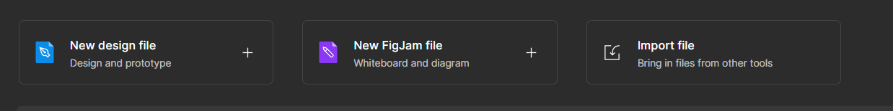

# UX/UI Design for MoonBank App

## Design App Used: [Figma](https://www.figma.com/) 🎖

 

You can preview the project by clicking the links below

- For Mobile preview, [click here](https://www.figma.com/file/eHU7d4sWTSz2qUaFrTkKNA/MoonBank---No-Country?node-id=0%3A1)
- For Desktop preview, [click here](https://www.figma.com/file/eHU7d4sWTSz2qUaFrTkKNA/MoonBank---No-Country?node-id=501%3A1700)

 

 

### Figma Sources Used 🎨

- [Android Navigations](https://www.figma.com/community/file/895622112730090829) ‖ 👉 by [Julius Löwe](https://www.figma.com/@loewe)
- [IoIcons](https://www.figma.com/community/file/1030151439728596277) ‖ 👉 by [Ilana Mallak](https://www.figma.com/@ilanamallak)
- [Bars — Fully customizable iOS and Android status bars](https://www.figma.com/community/file/1138623020723719349) ‖ 👉 by [Ahmad Ragab](https://www.figma.com/@ahmadragab)

### External Sources Used 🛒

- [SVGRepo](https://www.svgrepo.com/)
- [LordIcons](https://lordicon.com/)

### How to Use

Go to the [Figma](https://www.figma.com/) website, or use the Figma Desktop app, and log in using your google account.

Once logged in, look into the "Import File" button, then search for the "Moonbank - No Country.fig" file, and you are set.

 

## SCREENSHOTS

